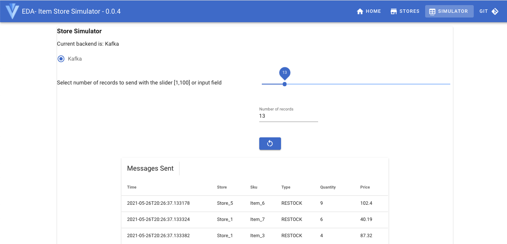
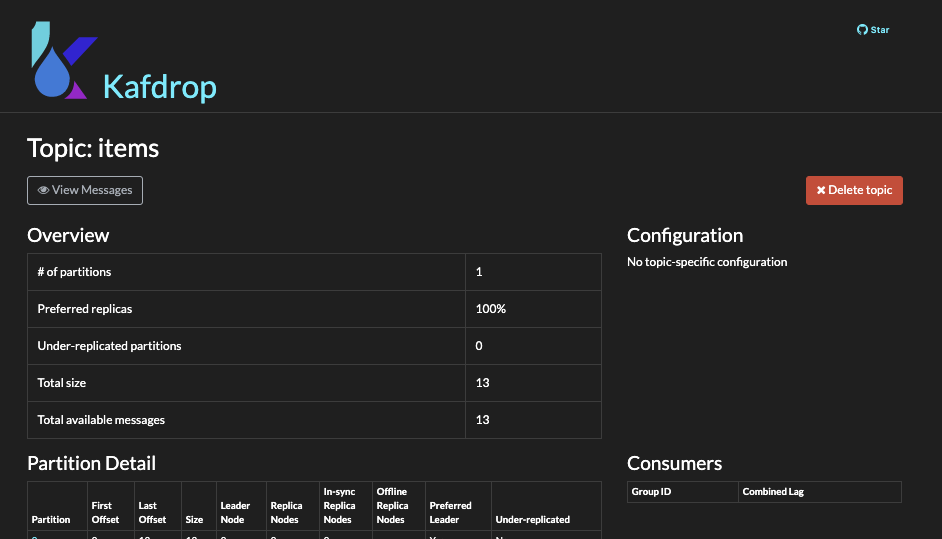
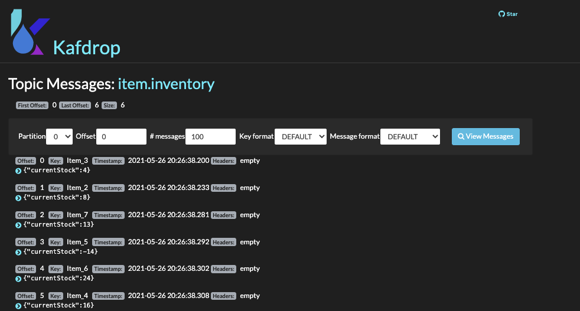

# Item sold aggregator component

This project illustrates combining Kafka Streams with reactive programming, and reactive messaging with Quarkus.
The goal of the Kafka streams implementation is to build a real time inventory view from items sold in different stores. The aggregates are kept in state store and expose via interactive queries.

The project is used as a Kafka Streams lab [documented here](https://ibm-cloud-architecture.github.io/refarch-eda/use-cases/kafka-streams/lab-3/) with instructions to deploy and run it on OpenShift.

Here is a simple diagram to illustrate the components used:

 

The goal of this note is to present how to run the solution locally using Strimzi Kafka image and instructions to build it from the beginning.

Updated 05/27/2021

## Pre-requisites

For development purpose the following pre-requisites need to be installed on your working computer:

**Java**
- For the purposes of this lab we suggest Java 11+
- Quarkus (on version 1.13.x)

**Git client**

**Maven**
- Maven will be needed for bootstrapping our application from the command-line and running
our application.

**Docker**

If you want to access the end solution clone the following git repository: `git clone https://github.com/ibm-cloud-architecture/refarch-eda-item-inventory`.

## In a hurry, just run it locally

* Start local Kafka: `docker-compose  up -d` to start one Kafka broker, and two item-inventory service instances. 
* Created the `items` and `item.inventory` topics on your Kafka instance
 
 ```shell
 ./scripts/createTopics.sh 
######################
 create Topics
Created topic items.
Created topic item.inventory.

./scripts/listTopics.sh 
######################
 List Topics
item.inventory
items
 ```

* Verify each components runs well with `docker ps`:

```sh
CONTAINER ID   IMAGE                                      PORTS                     NAMES
f31e4364dec9   quay.io/ibmcase/eda-store-simulator        0.0.0.0:8082->8080/tcp    storesimulator
2c2959bbda15   obsidiandynamics/kafdrop                   0.0.0.0:9000->9000/tcp    kafdrop
3e569f205f6f   quay.io/strimzi/kafka:latest-kafka-2.7.0   0.0.0.0:29092->9092/tcp   kafka
0cf09684b675   quay.io/strimzi/kafka:latest-kafka-2.7.0   0.0.0.0:2181->2181/tcp    zookeeper
```

* Start the app in dev mode: `./mvnw quarkus:dev`

Then [see the demonstration](#demonstration-script) script section below to test the application.

## Demonstration script

Once started go to one of the Item Aggregator API: [swagger-ui/](http://localhost:8080/q/swagger-ui/) and 
the `/api/v1/items/{itemID}` end point. Using the `Item_1` as itemID you should get an empty response.

* Send some item sale simulated records with `curl` on the simulator APIs: `curl -X POST http://localhost:8082/start -d '20'` or using the user interface at []()

  

* Use [Kafdrop UI](http://localhost:9000/) to see messages in `items` topic.

  

* Verify the store inventory is updated: `curl -X GET "http://localhost:8080/api/v1/items/Item_2" -H  "accept: application/json"`
* Verify messages are sent to `item.inventory` topic by 

  

**Remark: after the item aggregator consumes some items, you should see some new topics created, used to persist the 
the item store.**

## Developing the application from A to Z

To develop the same type of application see [this specific note](./docs/dev-app.md). It also includes some testing tools
for integration tests.


## Deploy on OpenShift cluster with Kafka Strimzi

* Be sure to have installed Strimzi operator (tested on 0.23) on OpenShift cluster. 
* Get th gitops project related to this current project:

```sh
git clone https://github.com/ibm-cloud-architecture/eda-lab-inventory/
```
* Select one of the existing Kafka users with TLS authentication or create a new one from the
 Event Streams console, with the produce, consume messages and create topic and schemas authorizations, 
 on all topics or topic with a specific prefix, on all consumer groups or again with a specific prefix, 
 all transaction IDs.

```shell
# if not logged yet to your openshift cluster where the docker private registry resides do:
oc login --token=... --server=https://c...
```

We use a user with TLS authentication named: `tls-user`

* Copy user's secret to the current project where the application will run

```shell
oc get secret  tls-user -n eventstreams --export -o yaml | oc apply -f -
```

* Copy the server side TLS certificate to your project:

```shell
oc get secret  sandbox-cluster-ca-cert -n eventstreams --export -o yaml | oc apply -f -
```


* Build and push the image to public registry

```shell
./mvnw package
docker build -f src/main/docker/Dockerfile.jvm -t ibmcase/item-aggregator:0.0.2 .
docker push ibmcase/item-aggregator:0.0.2
# build with s2i and push the image to private registry
./mvnw clean package -DQuarkus.kubernetes.deploy=true
```

